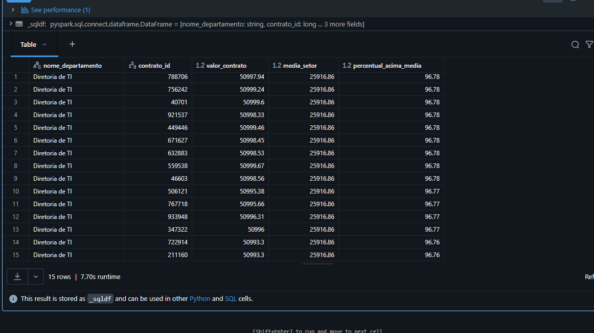

# 🚀 PySpark Medallion Pipeline: Public Contracts Anomaly Detection

## 📌 Project Overview
This project is an end-to-end Data Engineering pipeline built with **Apache Spark (PySpark)** and **Databricks**. It simulates a Big Data environment for a large public institution (like a Court of Justice or Government Agency), processing massive amounts of financial contracts to detect spending anomalies and optimize budget auditing.

The pipeline processes **1 Million records** natively in a distributed manner, applying data cleansing, business rules, and analytical aggregations using the **Medallion Architecture (Bronze, Silver, Gold)** and **Delta Lake** for scalable storage.

## 🏗️ Architecture & Data Flow

The project follows the Medallion architecture best practices for Data Lakes:

* **🥉 Bronze Layer (Raw Data):** Ingestion of 1,000,000 raw contract records. Data is generated in a distributed way using PySpark, simulating a real-world transactional system with intentional inconsistencies (nulls, duplicates) for testing data quality resilience. Stored as Managed Delta Tables.
* **🥈 Silver Layer (Cleansed & Conformed):** Data cleansing and enrichment. Deduplication, null value handling, and mapping of Department IDs to real institutional sectors (e.g., IT Directorate, Civil Court, HR). Data is partitioned by `Year` and `Month` to optimize future queries.
* **🥇 Gold Layer (Business Value & Analytics):** Advanced aggregations and Window Functions. 
    * **Department Expenses:** Aggregated total costs by department.
    * **Anomaly Detection:** Identification of contracts that exceed the historical average cost of their specific department by more than 50%, serving as a critical trigger for financial auditing.

## 🛠️ Technologies Used
* **Apache Spark (PySpark):** Distributed data processing and transformation.
* **Databricks:** Cloud-based data engineering environment and cluster management.
* **Delta Lake:** ACID transactions, scalable metadata handling, and unifies streaming and batch data processing.
* **Spark SQL:** Data querying and analytics.

## 📊 Key Insights & Results

Using PySpark `Window Functions`, the pipeline successfully isolated contracts with highly anomalous values. For instance, the query below identifies contracts in the IT Directorate that are **almost 97% above the sector's average spending**:

*Note: The image above demonstrates the Gold Layer output queried directly via Spark SQL.*

## 🚀 How to Run the Project
1. Clone this repository.
2. Import the `pyspark_contracts_pipeline.ipynb` file into your Databricks Workspace (Community Edition is fully supported).
3. Attach the notebook to an active cluster.
4. Run the cells sequentially to build the Bronze, Silver, and Gold tables.

## 👨‍💻 Author
Benjamin Farias Silva
**[Seu Nome Aqui]**
*Data Engineer*
[Link para o seu LinkedIn]
